<picture>
  <source media="(prefers-color-scheme: dark)" srcset="./dark.svg">
  <source media="(prefers-color-scheme: light)" srcset="./light.svg">
  
</picture>

---

### 🔬 About me

- 🎓 M.Tech Computational Biology, **IIIT Delhi** (2025–2027)
- 🧬 Research: chromatin compartments, condensates and epigenetic memory, Computational Genomics Lab (Dr. Vibhor Kumar)
- 🌱 Working on: deep learning + LLMs for cancer genomics and drug discovery
- 💼 Previously: Lab Assistant, ICAR-IARI Pune (Onion Hybrid Technology, 2024–2025)
- 🎯 Looking for: thesis collaboration and internships in cancer genomics, drug discovery, precision medicine
- 📫 pradip25215@iiitd.ac.in

---

### 🚀 Featured projects

| Project | What it does | Stack |
|---|---|---|
| 🧠 [BioBERT Literature Mining](https://github.com/pradip25215-sudo/biobert-literature-mining) | BioBERT NER on PubMed → disease knowledge graph for cancer epigenetics drug discovery | Transformers, NetworkX |
| 📊 [Cancer Genomics SQL Dashboard](https://github.com/pradip25215-sudo?tab=repositories) | SQL database, Kaplan–Meier, Cox model and Streamlit dashboard on 2,000 patients | SQL, Lifelines, Streamlit |
| 💊 [GNN Drug Solubility](https://github.com/pradip25215-sudo?tab=repositories) | GCN & GAT reaching R² = 0.90 on ESOL for ADMET prediction | PyTorch Geometric, RDKit |
| 🧬 [Protein Localization with ESM-2](https://github.com/pradip25215-sudo?tab=repositories) | Protein language model for subcellular localization | ESM-2, PyTorch |
| 🔬 [Single-Cell RNA-Seq](https://github.com/pradip25215-sudo?tab=repositories) | QC → clustering → cell-type annotation on 2,700 PBMCs | Scanpy |
| 🦟 [Mosquito RNA-Seq Pipeline](https://github.com/pradip25215-sudo?tab=repositories) | 30M-read pipeline finding plant-like transcripts in *Anopheles* | Trinity, DIAMOND, IQ-TREE2 |
| 🎙️ [Speech-to-Text with Whisper](https://github.com/pradip25215-sudo?tab=repositories) | Fine-tuned Whisper with speaker diarization | Whisper, PyTorch |

---

### 🛠️ Tech stack

**Languages** 

**ML / Deep learning** 

**Bioinformatics & cheminformatics** 

**Data & tools** 

**Currently learning:** Docker · FastAPI · AWS · LangChain · GROMACS

---

### 📊 GitHub activity

---

*"The best way to predict the future is to invent it."* — Alan Kay

